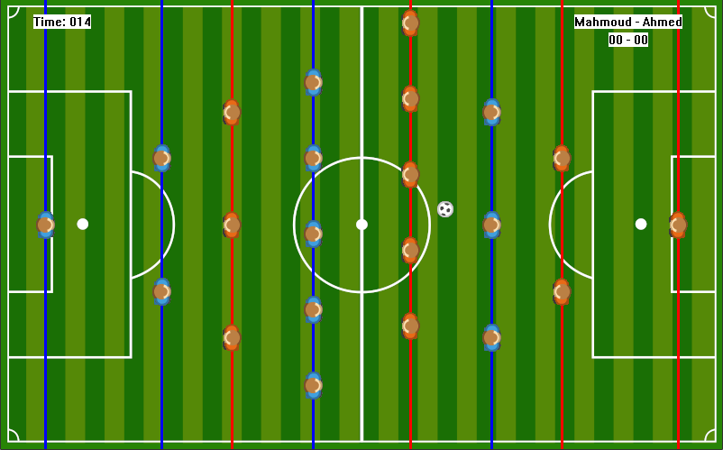
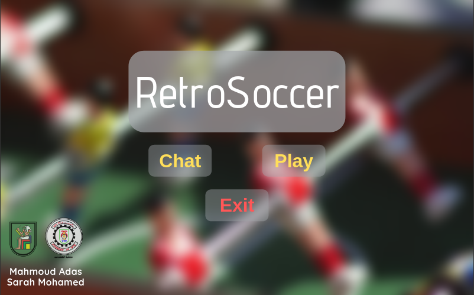
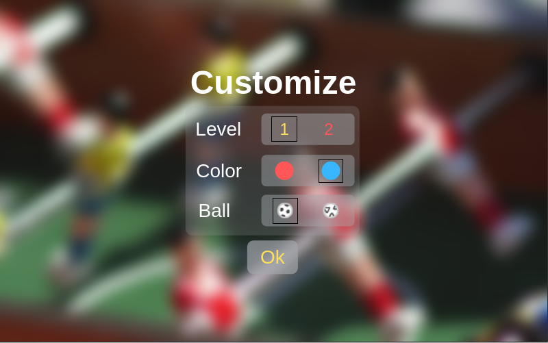
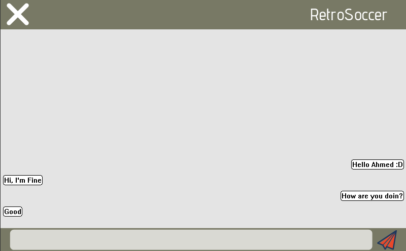

# Retro Soccer
2d multiplayer football game written completely in x86 32bit assembly with MASM

Microprocessor project for college

# Screen shots

Multiplayer mode over serial port

You can customize the level!

You can chat over serial port.

# How to build

Using visual studio 2015/2017, open RetroSoccer.sln

Make sure target architecture is x86(Win32) NOT x64. 

To open two sessions in same machine, use virtual serial ports. You could use com0com[https://sourceforge.net/projects/com0com/].

To play on multiple devices, go to RetroSoccer/common.inc and change and set CREATE_ANOTHER_WINDOW to TRUE. You would either use serial ports, usb-to-serial adapter or with virtual serial ports use com2tcp to forward serial data to local net then forward it back on the other device to a serial port (latest version of com2tcp [https://sourceforge.net/projects/com0com/files/com2tcp/]).

Make sure serial ports COM1 and COM2 are reserved for the game, otherwise change them in RetroSoccer/common.inc (FIRST_PLAYER_PORT, SECOND_PLAYER_PORT) to their ports number. If you are playing on multiple devices, just reserve one port for first player (FIRST_PLAYER_PORT).

